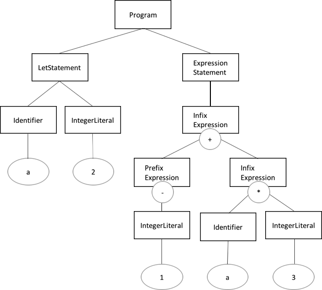

# 評価（Evalution）


## AST例

つぎのMiniMonkeyプログラムの文字列のASTとイメージ図です。

    let a = 2;
    -1 + a * 3;

* 文字列のAST

    ```
    let a = 2;
    ((-1) + (a * 3));
    ```

* ASTのイメージ図

    

評価器ではこのようなASTを評価してその結果（評価値）を取得します。


## 評価方式

* ツリーウォーキングインタプリタ

    - ASTを辿って各ノードが意味するものを逐次実行する
    - 簡単
    - 遅い
    - フットプリントが小さい

* バーチャルマシン

    - ASTをバーチャルマシン用のバイトコードに変換し、バイトコードを逐次実行する
    - 複雑
    - 速い
    - 移植性が高い
    - バイトコードを逐次実行するのではなく機械語に変換しながら実行する方式をJIT（Just In Time）インタプリタ/コンパイラと呼ぶ。さらに速い。


## ツリーウォーキングインタプリタ

今回実装するのはツリーウォーキングインタプリタです。

インタプリタを実装する上で必要になるのは下記の3点です。

* ASTを辿る
* 式を評価する
* 評価した値をインタプリタのホスト言語で表現する（データ変換）


### データ変換

MiniMonkeyで扱うデータ型はint64のみで十分ですが、後にほかのデータ型（ヌル、ブーリアン、文字列、配列、連想配列など）を追加した際に同様の操作で扱えるように共通のインターフェース(object.Object)を実装したデータ型に変換します。

    # object/object.go
    package object

    type ObjectType string

    type Object interface {
        Type() ObjectType
        Inspect() string
    }


### 環境

環境は値をシンボル（識別子）に束縛するための入れ物です。
シンボルの評価値はその時点の環境によって決定します。

次のコードでは現在の環境でシンボル`var`に値'5'を束縛しています。

    let var = 5;

実装はシンボルをkey、値をvalueとしたハッシュマップ（連想配列）です。
MiniMonkeyではハッシュマップをラップした構造体でこれを表現します。

    # object/environment.go
    package object 

    type Environment struct {
        store map[string]Object
    }

    func (e *Environment) Get(name string) (Object, bool) {
        val, ok := e.store[name]
        return val, ok
    }

    func (e *Environment) Set(name string, val Object) Object {
        e.store[name] = val
        return val
    }


## つくってみよう

[付属のソース](src/03/src/minimonkey)では評価器を途中まで作っています。

[evalutor.go](src/03/src/minimonkey/evalutor/evalutor.go)を編集して、今回は下記のASTノードを評価するところまで作ってみましょう。

1. ast.Program
2. ast.ExpressionStatement
3. ast.IntegerLiteral
4. ast.PrefixExpression
5. ast.InfixExpression
6. ast.LetStatement
7. ast.Identifier

テストは次のコマンドで実行できます。
'FAIL'がなくなるように実装してみましょう。

    $ cd src/03
    $ GOPATH=$(pwd) go test ./src/minimonkey/...

最終回では関数を実装予定です。

